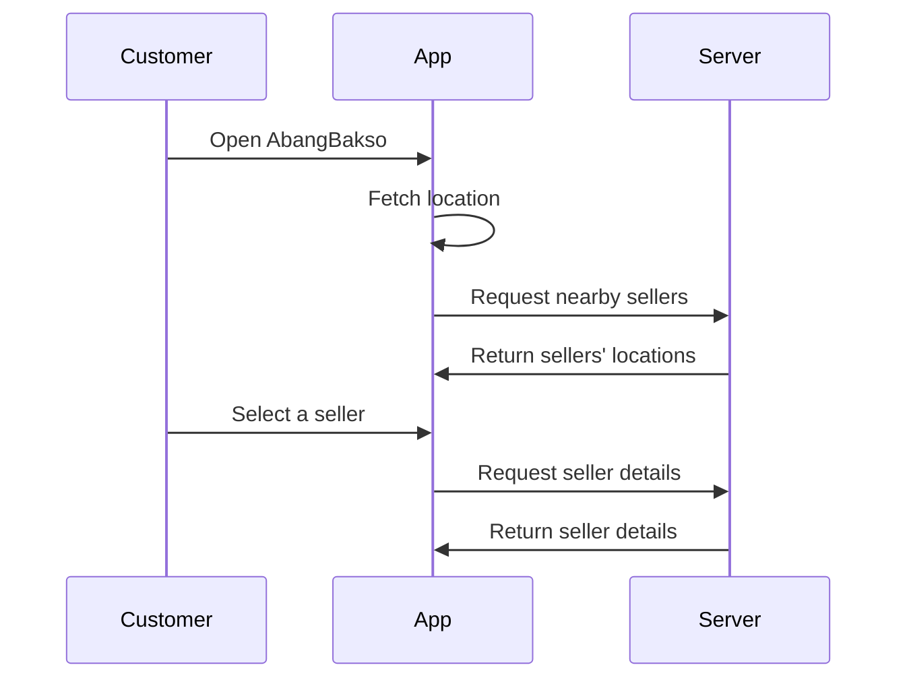
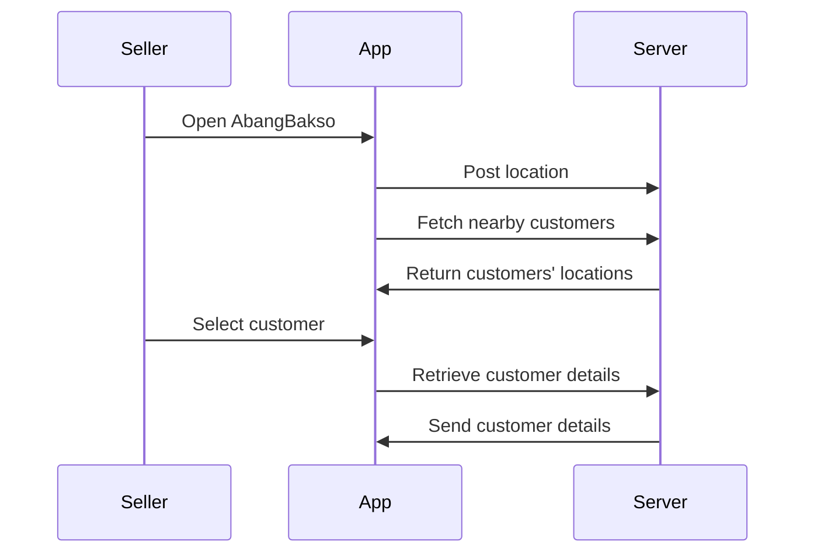

Here’s an advanced, organized structure for the **AbangBakso** project documentation based on the initial README:

---

# **AbangBakso 🍜**

[](https://github.com/Stradivary/bakso-app/actions/workflows/build.yml)

A real-time location-based app connecting Bakso sellers and customers in Indonesia. Discover Bakso sellers nearby, or help sellers find potential customers in their vicinity — all in one app.

---

## **Contents**

1. [Getting Started 🚀](#getting-started)
2. [Features ✨](#features)
3. [Project Structure 📁](#project-structure)
4. [Tech Stack 🛠️](#tech-stack)
5. [Application Workflows 📜](#application-workflows)
   - [Sequence Diagrams](#sequence-diagrams)
   - [Use Cases](#use-cases)
6. [Database Design 💾](#database-design)
7. [Setup and Deployment 🐳](#setup-and-deployment)
   - [Development](#development)
   - [Production](#production)
8. [Performance Optimization 🚀](#performance-optimization)
9. [Contributing 🤝](#contributing)
10. [Security Considerations 🔒](#security-considerations)
11. [Testing 🧪](#testing)
12. [Acknowledgments 👏](#acknowledgments)
13. [License 📄](#license)

---

## **Getting Started 🚀**

### Prerequisites 📋

- Docker & Docker Compose
- Git
- Node.js (v18 or above)
- Make (optional)

### Setup Instructions 🛠️

1. **Clone the repository**
   ```bash
   git clone https://github.com/yourusername/bakso-app.git
   cd bakso-app
   ```

2. **Configure environment variables**
   ```bash
   cp .env.example .env
   # Update .env with your configurations
   ```

3. **Start all services**
   ```bash
   docker compose up -d
   ```

4. **Access the application**
   - Frontend: [http://localhost:5173](http://localhost:5173)  
   - Supabase Studio: [http://localhost:8000](http://localhost:8000)

---

## **Features ✨**

- Real-time location updates for sellers and customers
- Interactive map powered by Leaflet.js
- Role-based views for **customers** and **sellers**
- Works offline with Progressive Web App (PWA) support
- Secure backend powered by Supabase
- Optimized for mobile and desktop experiences

---

## **Project Structure 📁**

```plaintext
bakso-app/
├── src/                # Vite React application
├── backend/            # Backend logic, including Supabase setup
├── public/             # Static assets and diagrams
├── LICENSE             # Licensing information
└── README.md           # Project documentation
```

---

## **Tech Stack 🛠️**

### **Frontend**
- **React.js**: Core framework
- **Mantine UI**: Rich component library
- **Leaflet.js**: Interactive maps
- **React Router**: Navigation
- **Vite**: Build tooling

### **Backend**
- **Supabase**: Auth Database and API
- **PostgreSQL**: Database with PostGIS for geospatial queries
- **Supabase/realtime**: Real-time api with supabase

### **DevOps**
- Static Site Generation with Vite
- Dockerized Backend architecture with Docker Compose
- Nginx for reverse proxy and SSL termination
- Automated CI/CD pipelines with GitHub Actions

---

## **Application Workflows 📜**

### Sequence Diagrams

#### **Customer Workflow**


#### **Seller Workflow**


### Use Cases

| Feature              | Screenshot                     |
|----------------------|---------------------------------|
| Auth Map             |  |
| Customer Map View    |  |
| Seller Interaction   | 
 |

---

## **Database Design 💾**
 
> TBD
---

## **Setup and Deployment 🐳**

### Development
- Clone the repository
- Start services with `docker compose up -d`
- Access the app on [localhost:5173](http://localhost:5173)

### Production
- Configure production `.env.prod`
- Build and deploy with:
  ```bash
  docker compose -f docker-compose.prod.yml up -d
  ```

---

## **Performance Optimization 🚀**

- **Spatial Indexing**: PostgreSQL with PostGIS for geo-queries
- **Frontend**: Optimized with React Context and memoization
- **PWA Features**: Enable offline capabilities
- **Caching**: Efficient API responses with Supabase optimizations

---

## **Security Considerations 🔒**

- **Data Protection**: Row Level Security (RLS) for user privacy
- **SSL Encryption**: For production deployments
- **Containerized Architecture**: Ensures isolation

---

## **Testing 🧪**

Run frontend tests:
```bash
cd src
npm run test
```

Run database tests:
```bash
docker compose exec supabase-db psql -U postgres -f tests/run.sql
```

---

## **Acknowledgments 👏**

- [Supabase](https://supabase.io)
- [Mantine UI](https://mantine.dev)
- [Leaflet.js](https://leafletjs.com)

---

## **License 📄**

Licensed under [MIT](LICENSE).  
