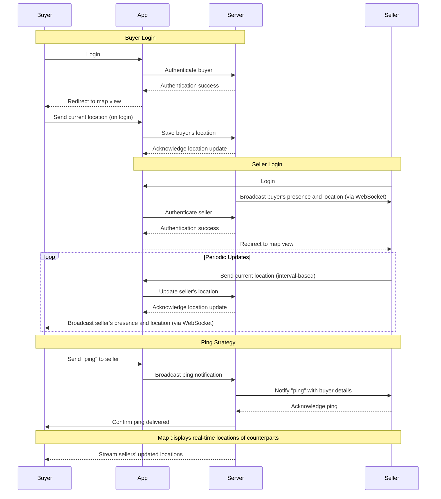

# **AbangBakso 🍜**

[](https://github.com/Stradivary/bakso-app/actions/workflows/build.yml)
[](https://sonarcloud.io/summary/new_code?id=Stradivary_bakso-app)
[](https://sonarcloud.io/summary/new_code?id=Stradivary_bakso-app)

A real-time location-based app connecting Bakso sellers and customers in Indonesia. Discover Bakso sellers nearby, or help sellers find potential customers in their vicinity — all in one app.

---

## **Contents**

1. [Getting Started 🚀](#getting-started)
2. [Features ✨](#features)
3. [Project Structure 📁](#project-structure)
4. [Tech Stack 🛠️](#tech-stack)
5. [Application Workflows 📜](#application-workflows)
   - [Sequence Diagrams](#sequence-diagrams)
   - [Use Cases](#use-cases)
6. [Database Design 💾](#database-design)
7. [Setup and Deployment 🐳](#setup-and-deployment)
   - [Development](#development)
   - [Production](#production)
8. [Performance Optimization 🚀](#performance-optimization)
9. [Contributing 🤝](#contributing)
10. [Security Considerations 🔒](#security-considerations)
11. [Testing 🧪](#testing)
12. [Acknowledgments 👏](#acknowledgments)
13. [License 📄](#license)

---

## **Getting Started 🚀**

### Prerequisites 📋

- Git
- Node.js (v18 or above)
- Vite

### Setup Instructions 🛠️

1. **Clone the repository**
   ```bash
   git clone https://github.com/yourusername/bakso-app.git
   cd bakso-app
   ```

2. **Configure environment variables**
   ```bash
   cp .env.example .env
   # Update .env with your configurations
   ```

3. **Install dependencies**
   ```bash
   npm install
   ```

4. **Start the development server**
   ```bash
   npm run dev
   ```

5. **Access the application**
   - Frontend: [http://localhost:5173](http://localhost:5173)

---

## **Features ✨**

- Real-time location updates for sellers and customers
- Interactive map powered by Leaflet.js
- Role-based views for **customers** and **sellers**
- Works offline with Progressive Web App (PWA) support
- Secure backend powered by Supabase Cloud
- Optimized for mobile and desktop experiences

---

## **Project Structure 📁**

```plaintext
bakso-app/
├── src/                # Vite React application
├── public/             # Static assets and diagrams
├── LICENSE             # Licensing information
└── README.md           # Project documentation
```

---

## **Tech Stack 🛠️**

### **Frontend**
- **React.js**: Core framework
- **Mantine UI**: Rich component library
- **Leaflet.js**: Interactive maps
- **React Router**: Navigation
- **Vite**: Build tooling

### **Backend**
- **Supabase Cloud**: Auth, database, and real-time API
- **PostgreSQL**: Database with PostGIS for geospatial queries

### **DevOps**
- Supabase Cloud for database and authentication
- VPS hosting for custom backend and proxy configurations
- CI/CD pipelines with GitHub Actions
- SonarCloud for code quality and coverage analysis

---
 
## **Application Workflows 📜**

### Sequence Diagrams

#### **Customer Workflow**


### Use Cases

| Feature              | Screenshot                     |
|----------------------|---------------------------------|
| Auth Map             |  |
| Customer Map View    |  |
| Seller Interaction   | 
 |

---

## **Database Design 💾**
 
erDiagram
    USER_PROFILES {
        uuid id(PK)  "Primary key, references auth.users"
        text role "Role: 'seller' or 'buyer'"
        geometry last_location "Last known location (Point, SRID 4326)"
        timestamptz last_seen "Last active timestamp"
        boolean is_online "Online status"
        timestamptz created_at "Record creation timestamp"
        text name "User's name (max 60 characters)"
        float8 latitude "Latitude of the user"
        float8 longitude "Longitude of the user"
    }

---

## **Setup and Deployment 🐳**

### Development
1. Clone the repository and install dependencies.
2. Run the app locally with `npm run dev`.
3. The app is served at [localhost:5173](http://localhost:5173).

### Production
1. Deploy the frontend to your VPS or preferred hosting platform.
   ```bash
   npm run build
   rsync -avz dist/ your-vps:/var/www/html
   ```
2. Configure Nginx (or another reverse proxy) to serve the `dist/` folder.

3. Backend services (database and API) are managed via **Supabase Cloud**. Ensure your environment variables point to the live instance.

---

## **Performance Optimization 🚀**

- **Spatial Indexing**: PostgreSQL with PostGIS for geo-queries
- **Frontend**: Optimized with React Context and memoization
- **PWA Features**: Enable offline capabilities
- **Caching**: Efficient API responses with Supabase optimizations

---

## **Security Considerations 🔒**

- **Data Protection**: Row Level Security (RLS) for user privacy
- **SSL Encryption**: Ensure HTTPS for frontend and API
- **Environment Isolation**: Separate environments for development and production

--- 

## **Testing 🧪**

Run frontend tests:
```bash
cd src
npm run test
```

Run database tests:
```bash
docker compose exec supabase-db psql -U postgres -f tests/run.sql
```

---

## **Acknowledgments 👏**

- [Supabase](https://supabase.io)
- [Mantine UI](https://mantine.dev)
- [Leaflet.js](https://leafletjs.com)

---

## **License 📄**

Licensed under [MIT](LICENSE).  
