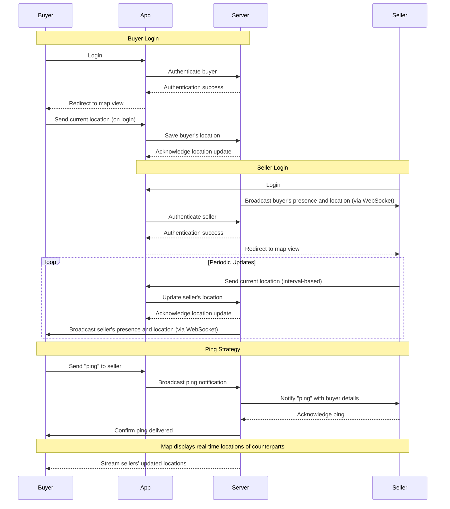

# Application Workflows 📜

## Sequence Diagrams

The following sequence diagrams illustrate the interactions between buyers, sellers, the app, and the server.

### Buyer Login and Location Flow

## Use Cases

| Feature              | Screenshot                     |
|----------------------|---------------------------------|
| Auth Map             |  |
| Customer Map View    |  |
| Seller Interaction   |  |